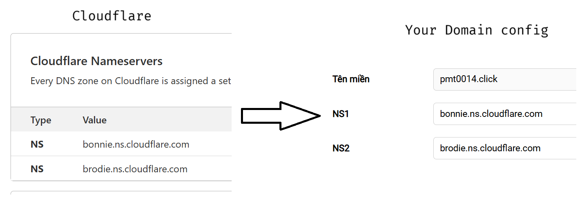
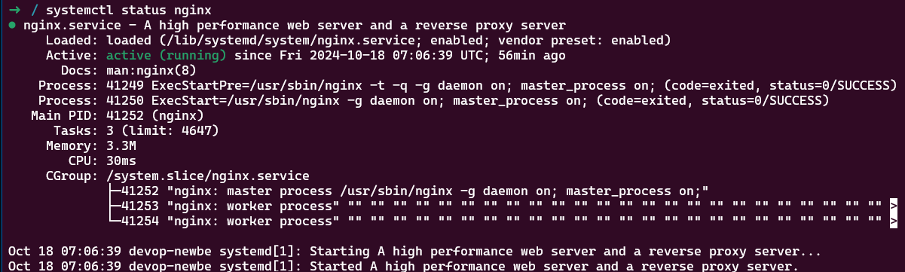

# DEVOPS Basic for dummy

## 1. Getting started:

### Things to do:

- Buy a domain (tenten optional)
- register Cloudflare account
- Buy a server (digitalocean optional) or connect to devops newbie server: `ssh root@178.128.92.6`
- install ubuntu (windows)

**Use cloudflare to manage your domain**:

add Cloudflare nameservers to your domain nameservers



### Ubuntu setup:

Open Ubuntu

create a ssh key:

```
ssh-keygen // generate ssh key
cat ~./ssh/id_rsa.pub // read file id_rsa.pub
```

add ssh key to your server config (digitalocean) so you can access host server

```
ssh root@your_server_ip
```

Now you are in your host server

Install docker, a http web server (nginx optional)

**Note**: It's a good practice to update local package

```
sudo apt update // update package
sudo apt install docker
sudo apt install nginx
```

Read this instruction if you find hard to follow following steps: [here](https://www.digitalocean.com/community/tutorials/how-to-install-nginx-on-ubuntu-22-04)

Video: [link](https://www.youtube.com/watch?v=1sdaPoXWQrw)

check system nginx status:

> systemctl status nginx



Back to Cloudflare, open your domain dashboard, click on your domain name
DNS section, choose `Records` option => Add record, type in DNS record type (search DNS record for more detail)

add type, add domain name, add server ip, open

check if you your server run correctly:
open browser, search `your_server_ip` or `http://your_domain_name`

if you see a `Welcome to nginx` page, then congrats, you are ready to advance to next step.

**NOTE**: run this command `sudo systemctl enable nginx` to re-enable the service to start up at boot. Which mean nginx service always ready to go, so your web stay alive

## 2. nginx config:

Create a directory for `your_domain`:

> sudo mkdir -p /var/www/your_domain/html

You can name `your_domain` folder whatever you like, if your config corrects, it will work. But, it is recommend to name the folder exactly to your domain name, so it is easier to manage if you have more than one website running on your server.

Assign ownership of the directory with the $USER environment variable:

> sudo chown -R $USER:$USER /var/www/your_domain/html

Next, create a index.html file, use `nano` command to open editor, so you can edit the content of newly created file:

> nano /var/www/your_domain/html/index.html


use `Ctrl + O`, `Enter` then `Ctrl + X`

you can use `cat` command to read file content:

> cat /var/www/pmt0014.click/html/index.html

Next change directory to /etc/nginx/, check nginx.conf. This is a basic setting of nginx, you can refer to how to configure your nginx config file from here.

Notice the `Virtual Host Configs` section, you can see there are two folders, conf.d and sites-enabled:

```
##
# Virtual Host Configs
##

include /etc/nginx/conf.d/*.conf; // accept file with .conf only
include /etc/nginx/sites-enabled/*; // accept all file type
```

Now go to /etc/nginx/conf.d/, create new nginx config file for your domain with .conf as mentioned above:

> nano /etc/nginx/conf.d/your_domain.conf

Paste this in newly created file.conf, change `your_domain` to your domain and `your_site` to the place where you hold your index.html [check this](#2-nginx-config):

```
server {
        listen 80;
        listen [::]:80;

        root /var/www/your_site/html;
        index index.html index.htm index.nginx-debian.html;

        server_name domain_name www.domain_name;

        location / {
                try_files $uri $uri/ =404;
        }
}
```

run `sudo nginx -t` check if your config is correct

if there aren't any problems, restart Nginx to enable your changes:

> sudo systemctl restart nginx

now try reload your site to see the change.

**NOTES**: In a production environment with active users, it’s generally better to use the `reload` command instead of `restart`, here why:

> sudo systemctl reload nginx

- `reload`: reload configuration without stopping the service. It allows nginx to apply new configuration without interrupting active connections
- `restart`: stop and then start the service, which can cause a brief downtime

Next step: [here](2.%20Build%20and%20Deploy.md)
