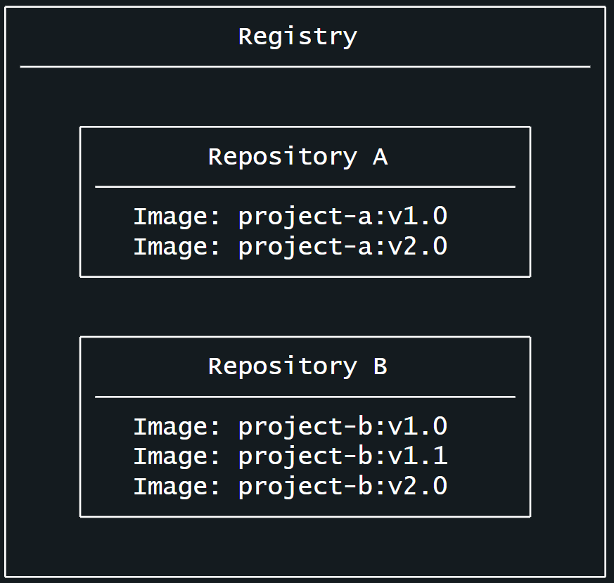

## What is docker registry?

In previous steps, you know what a container image is and how it works. And container images can be store on your computer system or server, but what if you want to share them with others on another machine?

> The answer is Docker registry

Think of image registry as a centralized location for storing and sharing your container images. It can be either public or private.

Have try [Docker Hub](https://hub.docker.com/), pull and build image from it. Well, Docker Hub is a public registry that anyone can use and is the default registry. While Docker Hub is a popular option, there are many other available container registry: [Amazon Elastic Container Registry(ECR)](https://aws.amazon.com/ecr/), [Azure Container Registry(ACR)](https://azure.microsoft.com/en-in/products/container-registry), and [Google Container Registry(GCR)](https://cloud.google.com/artifact-registry).

You can even run your private registry on your local system or inside your organization.

## Registry vs. repository

You might hear that registries and repositories can be interchanged. Well, they're related, but they're not quite the same thing.

A `registry` is a centralized location that stores and manages container images, whereas a `repository` is a collection of related container images within a registry. Think of it as a folder where you organize your images based on projects. Each repository contains one or more container images.

The following image shows the relationship between a registry, repositories, and images.



Now try set up your own docker registry. You can follow this tutorial for more detail. ([here](https://www.digitalocean.com/community/tutorials/how-to-set-up-a-private-docker-registry-on-ubuntu-22-04?ref=dailydev))

Or, follow my lead, which is not recommend `:))`

First, create a folder named `docker-registry`, or name it whatever you want.

Here the folder structure:

`root`:

- `docker-registry`:
  - `auth`: where you store your authenticate to access your registry, in case you want your registry to be private
  - `data`: store your repositories
  - `docker-compose.yml`

Add a record for your registry on cloudflare, make change according to it in nginx file in your routing service. Then restart your service to make it work. If you wonder what nginx file look like then [here](./ubuntu%20server%20structure/root/proxy/conf.d/config_example.nginx) it is.

You will need to setup the authentication:

```
# Install apache2-utils for htpasswd
sudo apt install apache2-utils -y

# Create auth file (replace username)
sudo htpasswd -Bc /docker-registry/auth/htpasswd username
```

Type in your username and password

Now here the docker-compose.yml content:

```
version: '3'

services:
  registry:
    image: registry:2
    ports:
      - "5000:5000"
    environment:
      REGISTRY_AUTH: htpasswd
      REGISTRY_AUTH_HTPASSWD_PATH: /auth/htpasswd/registry.password
      REGISTRY_AUTH_HTPASSWD_REALM: Registry Realm
      REGISTRY_STORAGE_DELETE_ENABLED: "true"
    volumes:
      - ./data:/var/lib/registry
      - ./auth:/auth
    restart: always
```

I will not go into detail, just search on internet if you want to know what those setting are. Believe me, it very basic, nothing fancy here.

**NOTE**: If you don't have SSL setup yet, you'll need to configure Docker to accept insecure registries. Add this to `/etc/docker/daemon.json`:

```
{
  "insecure-registries" : ["registry.pmt0014.click"]
}
```

Now run `docker-compose up -d` command inside folder where you store your docker-compose.yml file

Check if it running `docker ps`, if you see something running on port 5000 (or any port you config), well, it might work.

Ok now try to login your registry, `docker login your_registry_domain`

Put in the username and password that you setup before, if you logged in, you good to go. If you don't, you fucked up, search internet for help.

Now try to push some images in your registry and try to pull them from another machine.
